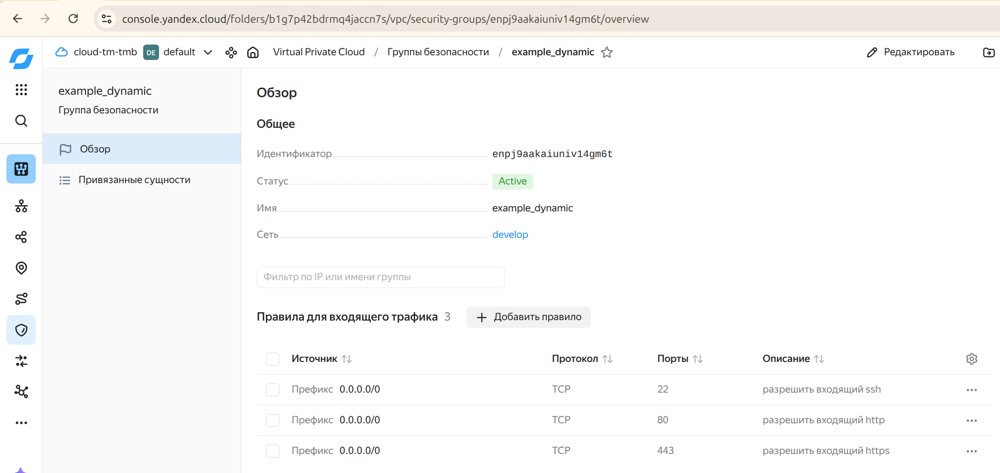
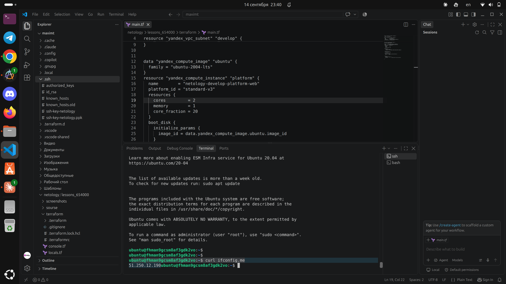
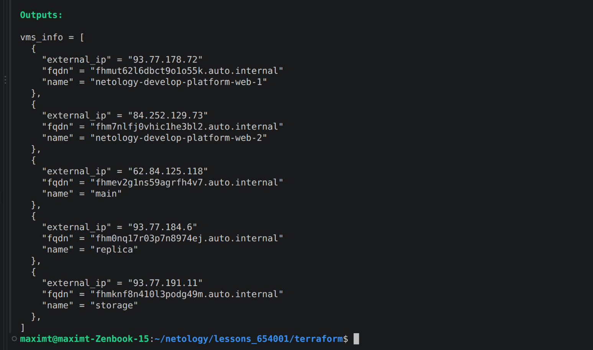

# Домашнее задание к лекции «Управляющие конструкции»

Terraform + Yandex Cloud. Код в папке `terraform/`.

## Задание 1
Создал группу безопасности с правилами через dynamic-блоки (ingress 22/80/443, egress).

## Задание 2
- web-серверы — через `count` (2 одинаковые ВМ, web-1 и web-2).
- db-серверы — через `for_each` (main и replica), параметры берутся из `each.value`.

## Задание 3
- 3 одинаковых диска через `count`.
- ВМ `storage` (одна, без count/for_each), диски подключены через `dynamic "secondary_disk"`.

## Задание 4
Inventory для ansible через `templatefile` + `local_file` (`ansible.tf`, шаблон `ansible.tftpl`).
3 группы: webservers, databases, storage. Добавил `fqdn`.

## Задание 5 (со звёздочкой)
`output "vms_info"` — список словарей по всем ВМ (name, external_ip, fqdn), собран через `concat`.

## Задание 6 (со звёздочкой)
- `null_resource` + `local-exec` запускает `ansible-playbook` (`null_resource.tf`).
- В шаблоне `ansible_host` через `coalesce` — берёт внешний IP, а если его нет (nat=false) — внутренний.

Все ресурсы после проверки удалены `terraform destroy`.
